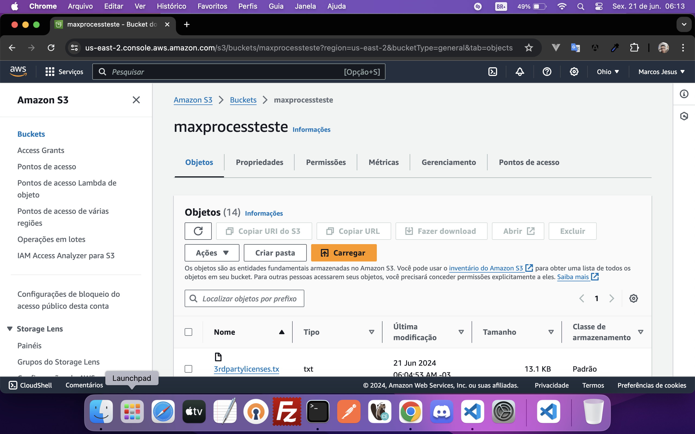

# Frontend Docs (LEIA)
**This project was generated with [Angular CLI](https://github.com/angular/angular-cli) version 14.0.6.**

O que estou usando:<br>
Linguagem: Javascript<br>
Framework: Angular 14.0.0 / CLI 14.0.6 <br>
RxJS: 7.50<br>
Typescript: 4.7.2<br>
Node: v18.20.3
Npm: v10.7.0

Bibliotecas usadas:

```bash
  # PrimeNg -> 14.2.3
  https://www.primefaces.org/primeng-v14-lts/
  #PrimeFlex -> 2.0.0
  https://github.com/primefaces/primeflex/wiki/PrimeFlex-v2
  #PrimeIcons -> 6.0.1
  https://www.primefaces.org/primeng-v14-lts/icons
```

## Development server
Para rodar essa aplicação é necessário rodar o script ng serve, aplicação local rodara na porta padrão do angular 4200.
http://localhost:4200/

## AWS
Criação e configuração realizada para criação de Bucket na AWS S3.
Configuração realizada no Github Action com as credenciais geradas na AWS.
Gerada pipeline com steps de deploy (Instalação de libs, build, e afins... que não foram implementado como step de teste unitário etc...) e configurações das secrets e variables do Github Action.

Criado uma esteira de deploy automatizada CI/CD no S3 da AWS ao realizar o merge e push para branch master.
## Em Desenvolvimento...
http://maxprocessteste.s3-website.us-east-2.amazonaws.com/



